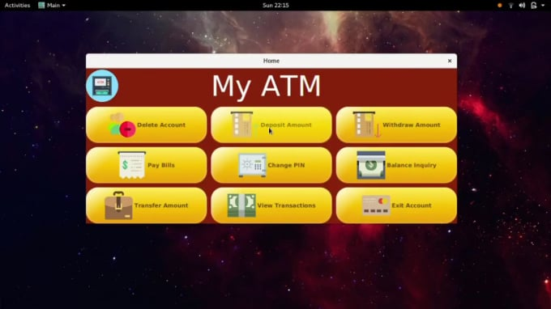

# My ATM Machine
A Functional GUI ATM Application made as part of my Object Oriented Course using JavaFX.
Has support for the following features:
- Create/Login Account
- Deposit/Withdraw Cash
- Transfer Amount to another Bank Account
- Pay Utility Bills *(Electricity, Mobile and Water)*

